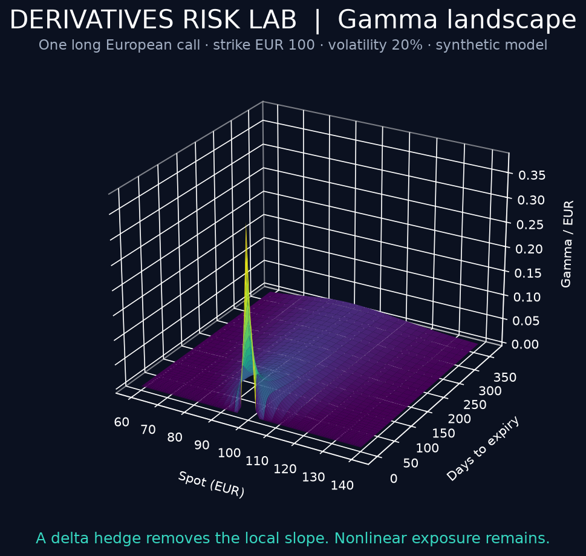

# Derivatives Risk Lab

**Interactive 3D Greeks with a financial story: what a delta hedge fixes, and what it leaves exposed.**
[🚀 Open the interactive demo](https://derivatives-risk-lab-joan.streamlit.app)

A Python options workbench for finance and risk interviews. Rotate a Greek surface, inspect signed portfolio exposures, apply market shocks and explain why a locally delta-neutral portfolio can still lose money.



The default synthetic short straddle loses **EUR 12,209** under a +5% spot move, +3 volatility points and one elapsed day. An initial stock delta hedge reduces the loss to **EUR 9,744**, after one-way execution cost. Gamma and vega remain. These are conditional market-value changes, before financing and dividends—not a return forecast.

## Run locally

Requires Python 3.11–3.13. From the repository root:

```bash
python -m venv .venv
source .venv/bin/activate  # Windows: .venv\Scripts\activate
pip install -e '.[app,dev]'
streamlit run app.py
```

For the dependency-free analytics demo:

```bash
derivatives-demo
```

A core-only `pip install .` has no third-party runtime dependencies. The self-contained [interactive gamma surface](docs/gamma-surface.html) can also be opened locally in a browser without running Streamlit. GitHub's file viewer does not execute HTML; download that file first.

## What it demonstrates

| Capability | Implementation | How it is checked |
|---|---|---|
| European options | Black–Scholes–Merton with continuous dividend yield | Known prices, no-arbitrage bounds and put–call parity |
| Five Greeks | Analytical delta, gamma, vega, theta and rho | Central finite differences for calls/puts across market regimes |
| 3D visual analysis | Spot × expiry surfaces, heatmaps and cross-sections | Executable Streamlit controls and browser inspection |
| Independent pricing mechanism | European Cox–Ross–Rubinstein tree | Convergence toward analytical values |
| Implied volatility | Bisection with arbitrage bounds and finite search interval | Roundtrip inversions and invalid-premium tests |
| Portfolio risk | Signed contracts, multipliers and aggregated Greeks | Aggregation, offsetting positions and horizon tests |
| P&L explanation | Delta/gamma/vega/theta/rho approximation plus explicit residual | Exact repricing reconciliation and small-shock behavior |
| Delta hedge | Initial stock hedge, nonlinear stress and execution cost | Zero initial delta and persistent short-gamma losses |

The analytics engine is implemented from scratch using Python's standard library. SciPy appears only in tests to cross-check the normal distribution. Streamlit, Plotly and pandas power the interface. The tree benchmark uses a different valuation mechanism, but is still project code; this is not a QuantLib or market-price certification.

## A two-minute interview demo

1. Start on **3D Greeks / Gamma**. Rotate the surface and explain the near-strike concentration close to expiry.
2. Switch to **Vega**. Explain why an underlying-stock hedge cannot remove volatility exposure.
3. Open **Portfolio & hedge**. The default is short 50 calls and 50 puts, each with multiplier 100.
4. Show the initial stock hedge and the curved post-hedge P&L profile.
5. Open **P&L explain**. Compare exact repricing, the Greek approximation and the residual.
6. Point out that the post-shock delta is no longer zero: this is a static hedge, not continuous rebalancing.
7. Open **IV & validation** and compare the analytic price with the independent tree.

See [interview questions](docs/INTERVIEW.md) for a concise explanation of the model's limitations and the role of each portfolio project.

## Python API

```python
from derivatives_lab import Market, Option, greeks, price, implied_volatility
from derivatives_lab import Scenario, explain
from derivatives_lab.demo import preset

market = Market(spot=100, volatility=0.20, rate=0.03, dividend=0.0)
option = Option(strike=100, expiry=90 / 365, kind="call")

premium = price(option, market)
risk = greeks(option, market)
print(premium, risk.delta, risk.vega_point, risk.theta_day)
print(implied_volatility(option, market, premium))

report = explain(
    preset("Short straddle"), market, Scenario(spot_return=0.05, vol_points=3, rate_bp=0, days=1)
)
print(report.exact_pnl, report.approximation, report.hedged_pnl)
```

## Units and scope

- Annual volatility, rate and continuous dividend yield are decimals in the engine.
- A volatility shock of **1 point** means 20% → 21%, not 20% → 20.2%.
- Delta is shares per option unit; portfolio delta includes signed contracts × multiplier.
- Gamma is change in delta for a EUR 1 spot move.
- Display vega is EUR per volatility point; theta EUR per calendar day; rho EUR per rate basis point.
- Internal vega/rho are per 1.0 decimal change; internal theta is per elapsed calendar year.
- The 3D surface represents one **long option unit**, not the signed portfolio.
- Expiry prices are intrinsic payoffs; Greeks at expiry are rejected explicitly.
- The hedge uses fractional shares, is initiated once, and is not rebalanced.
- Scenario results exclude financing, stock dividends, initial margin and hedge unwind. Only the stated one-way stock execution cost is deducted.

See [methodology](docs/METHODOLOGY.md) for formulas and approximation conventions.

## Architecture

```text
app.py                          Streamlit and Plotly interface
src/derivatives_lab/
  models.py                     Immutable market, option and position contracts
  pricing.py                    Normal CDF/PDF, BSM value and analytical Greeks
  solvers.py                    Implied volatility and CRR tree benchmark
  portfolio.py                  Aggregated exposure, scenarios and static hedge
  demo.py                       Portfolio presets and installed JSON CLI
 tests/                         Financial, solver, portfolio and interface checks
 docs/                          Methodology, interview guide and interactive surface
 .github/workflows/ci.yml        Python 3.11 / 3.12 / 3.13 quality checks
```

## Validate

```bash
ruff check .
ruff format --check .
mypy
pytest
python -m build
```

Tests include negative rates, nonzero dividends, near-expiry options, signed positions, solver failures and UI changes. A 95% coverage gate applies to the analytics package; it does not claim branch coverage or coverage of all interface paths. [Local validation notes](docs/VALIDATION.md) record the observed results. GitHub Actions has been configured; remote CI runs after publication.

## How to position the three projects

1. **P&L Control & Explain — lead project for this vacancy.** Daily control, investigation, management reporting and operational traceability.
2. **Derivatives Risk Lab — visual derivatives demonstration.** Options knowledge, nonlinear exposure and the limits of hedging.
3. **Fixed Income Analytics — underlying quantitative foundation.** Bond valuation, bootstrapping and interest-rate sensitivities.

Together they demonstrate complementary skills. They do not constitute a total-balance-sheet profitability platform, and a portfolio does not substitute for professional experience.

## Publish

Create an empty `derivatives-risk-lab` GitHub repository, then:

```bash
git init -b main
git add .
git commit -m "Build European options and 3D Greeks risk lab"
git remote add origin https://github.com/YOUR_USERNAME/derivatives-risk-lab.git
git push -u origin main
```

Suggested description: “European option pricing, 3D Greeks, portfolio P&L attribution and static delta-hedge analysis in Python and Streamlit.”

Suggested topics: `python`, `derivatives`, `options`, `greeks`, `risk-management`, `plotly`, `streamlit`.

For a hosted Streamlit demo, select `app.py`, Python 3.12 and the root requirements file. No credentials are required. Publication/hosting has not been performed as part of this local deliverable.

## Model boundaries

European exercise only, flat volatility per market snapshot, continuous dividend yield and deterministic rates. No American exercise, smile/skew, discrete dividends, stochastic volatility, liquidity, credit, margin or transaction-cost pricing. Values are illustrative model outputs. Implied volatility is only supported within the finite solver bracket and can be numerically ill-conditioned when vega is near zero. Extreme numerical magnitudes are outside the intended ordinary market scales.

## References

- [Options Industry Council — Volatility and the Greeks](https://prd-web.optionseducation.org/advancedconcepts/volatility-the-greeks): risk interpretation.
- [CME — Options gamma](https://www.cmegroup.com/education/courses/option-greeks/options-gamma-the-greeks): delta change and gamma exposure.
- [CME — Options and risk management workshop](https://www.cmegroup.com/articles/files/2023/pro-workshop-series-post-webinar-recording-week4-slides.pdf): delta-hedging context.
- [SciPy — Normal distribution](https://docs.scipy.org/doc/scipy/reference/generated/scipy.stats.Normal.html): independent numerical cross-checks in tests.

MIT licensed. See [LICENSE](LICENSE).
